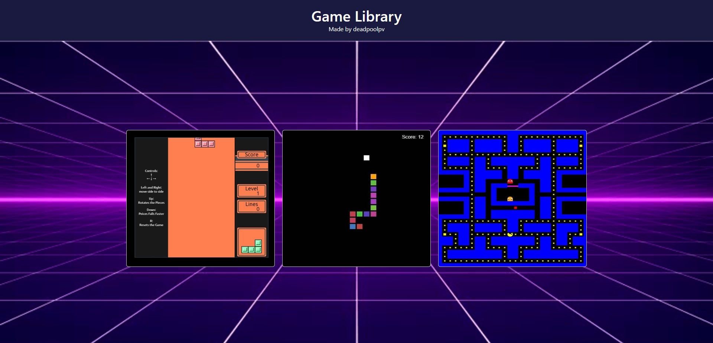

**Game Library**



**Overview**

This repository contains a collection of classic arcade games, including Tetris, Snake, and Pacman, implemented using HTML, CSS, and JavaScript. The project aims to provide a nostalgic gaming experience while showcasing my web development skills.

**Features**

* **Tetris:** Players can control the falling blocks to create complete lines and clear them from the screen.
* **Snake:** Players guide the snake to eat food while avoiding collisions with itself or the walls.
* **Pacman:** Players control Pacman to eat pellets and power pellets while evading the ghosts.

**Technical Details**

* **HTML:** Provides the basic structure of the web pages.
* **CSS:** Handles the styling and layout of the games.
* **JavaScript:** Implements the game logic, user interaction, and graphics rendering.
* **Canvas API:** Used to draw the game elements on the screen.
* **Keyboard Events:** Handle user input for game controls.

**How to Use**

1. **Clone the repository:** ```git clone https://github.com/DEADPOOLpv/Small-Game-Library.git```
2. **Open the index.html file:** Open the index.html file in your web browser.
3. **Play the games:** Use the arrow keys to control the games.


**This project demonstrates my ability to:**

* **Design and implement interactive web applications:** I created responsive and engaging game interfaces.
* **Master HTML, CSS, and JavaScript:** I utilized these core web technologies to build the games from scratch.
* **Utilize the Canvas API:** I leveraged the Canvas API to create dynamic and visually appealing game graphics.
* **Handle user input and game logic:** I implemented event listeners to capture user input and wrote the logic to control game behavior.
* **Debug and optimize code:** I ensured the games run smoothly and efficiently.
* **Leverage cloud technologies:** I deployed the application to AWS, demonstrating my skills in cloud infrastructure and deployment.

I am passionate about web development and enjoy creating fun and interactive experiences. This project is a testament to my skills and my commitment to crafting high-quality web applications.

**License**

This project is licensed under the MIT License.
